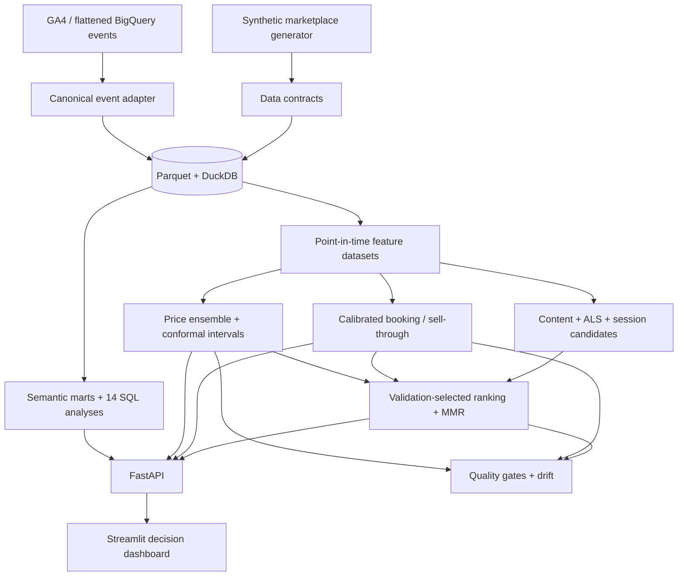

# DriveIntent

DriveIntent is a deployable ML, recommendation, and SQL intelligence platform
for an Indian used-car marketplace. It was rebuilt as a CARS24-oriented
assignment that connects four decisions in one reproducible system:

- fair-price regression with calibrated price intervals;
- booking and 30-day sell-through classification;
- hybrid candidate generation, learning-to-rank, and diverse recommendations;
- GA4-style journey, campaign, customer, inventory, and recommender analytics.

Every included customer, event, vehicle, and campaign is synthetic. No CARS24
data, credentials, or proprietary code is used.

## Verified results

These figures come from the deterministic small profile and temporal test
window (`seed=42`). They are reproducible with `make pipeline-small`.

| Decision | Deployed result | Reference |
| --- | ---: | ---: |
| Fair price | MAE ₹88,358; R² 0.8585 | Global-median MAE ₹241,485 |
| Booking propensity | ROC-AUC 0.7401; PR-AUC 0.0981 | Base rate 0.0325; top-5% lift 4.50× |
| 30-day sell-through | ROC-AUC 0.5544; PR-AUC 0.3471 | Base rate 0.2607; top-5% lift 1.92× |
| Recommendation rank | NDCG@10 0.6282; Recall@10 0.8782 | Raw LTR NDCG@10 0.4651 |

The price champion is a validation-selected convex ensemble (Extra Trees,
CatBoost RMSE, and CatBoost MAE). The ranking champion is selected only on the
validation window; on this dataset it correctly retains session intent rather
than deploying the weaker raw ranker. This is deliberate model governance, not
metric cherry-picking. All 11 configured deployment gates pass. See
[`docs/VERIFIED_RESULTS.md`](docs/VERIFIED_RESULTS.md) for evaluation boundaries.

## System architecture



The design enforces temporal splits, point-in-time context, leakage bans,
position-propensity weighting, validation-only champion selection, calibrated
classification probabilities, conformal price intervals, and SHA-256 artifact
and feature-contract verification.

## SQL expertise

SQL is executable application code here—not a folder of decorative snippets.
The DuckDB layer contains:

- typed raw table contracts;
- session, car, and campaign-day semantic marts;
- cohort retention with a date spine;
- first-, last-, and linear-touch campaign attribution;
- funnel transition-time quantiles;
- inventory survival risk sets and cumulative survival;
- customer-360 lifecycle and recency/value segmentation;
- inverse-propensity recommendation evaluation;
- anti-join and invariant-based data-quality checks.

`scripts/run_sql_analytics.py` runs all 14 reviewed queries, exports their
results and runtimes, and fails on warehouse violations. FastAPI exposes only an
allowlist of repository-owned insights; clients cannot submit arbitrary SQL.
Read [`docs/SQL_ANALYTICS.md`](docs/SQL_ANALYTICS.md).

## Repository map

| Path | Purpose |
| --- | --- |
| `src/driveintent/data` | Synthetic generation, validation, GA4 adapter, DuckDB loader |
| `sql/ddl`, `sql/marts` | Warehouse contracts and reusable semantic views |
| `sql/analytics`, `sql/quality` | Decision queries and executable data tests |
| `src/driveintent/features` | Point-in-time features and intent profiles |
| `src/driveintent/models` | Regression, classifiers, recommenders, ranker, registry |
| `src/driveintent/monitoring` | PSI/JS drift and deployment quality gates |
| `src/driveintent/api` | Pricing, conversion, recommendation, SQL, monitoring APIs |
| `src/driveintent/dashboard` | Six-page Streamlit application |
| `tests` | 71 data, SQL, model, API, serving, and deployment tests |
| `render.yaml`, `Dockerfile.*` | Two-service deployment definition |

## Open in VS Code

Python 3.11 or 3.12 is supported. In the extracted project folder:

```bash
python3 -m venv .venv
source .venv/bin/activate
python -m pip install -e ".[dev]"
python scripts/run_pipeline.py --small
```

On Windows PowerShell, activate with `.venv\Scripts\Activate.ps1`. Then open the
folder in VS Code and choose the `.venv` interpreter. Repository settings enable
pytest discovery automatically.

Useful commands:

```bash
make sql-analytics    # execute and export the SQL portfolio
make quality-gate     # enforce the 11 model gates
make test             # secret scan plus 71 tests
make api              # http://localhost:8000/docs
make dashboard        # http://localhost:8501
```

The full synthetic profile is available through `make pipeline`; start with the
small profile to confirm the environment.

## GA4 import contract

Export a flattened GA4/BigQuery result to CSV or Parquet, then run:

```bash
python scripts/import_ga4.py path/to/ga4_export.parquet \
  --output-dir data/ga4_canonical --unknown-events error
```

Required input columns are `event_timestamp`, `event_name`,
`user_pseudo_id`, and `ga_session_id`. Optional mappings cover item IDs/list
positions, source/medium/campaign, engagement milliseconds, device, geography,
page location, search, and filters. Unknown taxonomy can fail closed or be
dropped explicitly.

## API and deployment

After the pipeline finishes:

```bash
uvicorn driveintent.api.main:app --host 0.0.0.0 --port 8000
streamlit run src/driveintent/dashboard/app.py --server.port 8501
```

The API health endpoint stays degraded until the database and every verified
artifact are present. Pricing, conversion, recommendations, monitoring, and
allowlisted SQL insights are documented at `/docs`.

For containers:

```bash
docker compose up --build
```

For a GitHub-connected Render deployment, use `render.yaml`. The explicit
`DRIVEINTENT_BOOTSTRAP_DEMO=1` switch creates deterministic demo assets in an
empty runtime; serving otherwise fails closed. Read [`DEPLOYMENT.md`](DEPLOYMENT.md)
and [`docs/CARS24_SYSTEM_DESIGN.md`](docs/CARS24_SYSTEM_DESIGN.md).

## Scope and responsible use

This is a portfolio-grade reference implementation. Its synthetic accuracy is
not evidence of real-market performance. Real deployment requires warehouse and
event contracts, privacy/consent controls, randomized recommendation exploration,
segment/fairness review, persistent model storage, latency SLOs, canaries,
human-reviewed pricing policy, and online A/B tests.

See [`SECURITY.md`](SECURITY.md) and [`LICENSE`](LICENSE).
