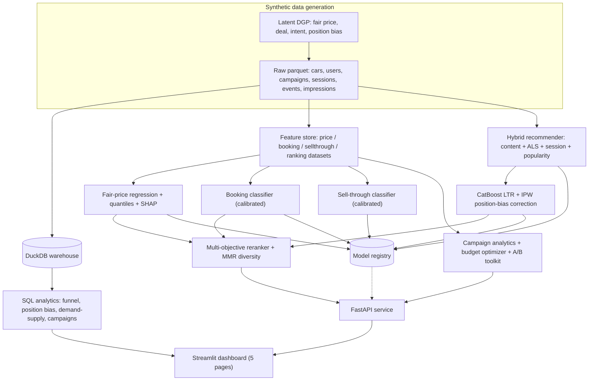

# 🚗 DriveIntent — Intent-Aware Used-Car Marketplace Intelligence

DriveIntent is an end-to-end data-science / ML platform for a CARS24-style used-car
marketplace. It generates a realistic **synthetic** Indian marketplace with latent
buyer intent and position bias, then builds the full modelling stack a marketplace
DS team would own: fair-price estimation with uncertainty, conversion and
sell-through prediction, a hybrid intent-aware recommender with learning-to-rank and
position-bias correction, multi-objective reranking, campaign lead-quality analytics
with a budget optimizer, and an A/B-testing toolkit — all served behind a FastAPI
service and a 5-page Streamlit dashboard.

> **Everything here is synthetic.** The numbers demonstrate *methodology*, not real
> CARS24 performance. The data-generating process is deliberately transparent so that
> every modelling choice can be checked against known ground truth.

---

## Table of contents

1. [Why this project](#1-why-this-project)
2. [What it does](#2-what-it-does)
3. [Architecture](#3-architecture)
4. [Repository layout](#4-repository-layout)
5. [Quickstart](#5-quickstart)
6. [The synthetic data-generating process](#6-the-synthetic-data-generating-process)
7. [Leakage & latent-variable discipline](#7-leakage--latent-variable-discipline)
8. [Temporal validation](#8-temporal-validation)
9. [Models](#9-models)
10. [Position bias & IPW](#10-position-bias--ipw)
11. [Multi-objective reranking](#11-multi-objective-reranking)
12. [Intent inference](#12-intent-inference)
13. [Campaign analytics & budget optimizer](#13-campaign-analytics--budget-optimizer)
14. [A/B testing toolkit](#14-ab-testing-toolkit)
15. [Results (small profile)](#15-results-small-profile)
16. [API](#16-api)
17. [Dashboard](#17-dashboard)
18. [SQL analytics](#18-sql-analytics)
19. [Testing](#19-testing)
20. [Configuration](#20-configuration)
21. [Docker](#21-docker)
22. [Business insights](#22-business-insights)
23. [Limitations & honest caveats](#23-limitations--honest-caveats)
24. [Interview discussion points](#24-interview-discussion-points)

---

## 1. Why this project

Marketplace DS work is defined by two hard problems that generic ML tutorials skip:

- **Feedback loops & bias.** What users click is a function of what the ranker showed
  them, so naïve click models learn the ranker's old habits. DriveIntent bakes
  position bias into the data and corrects for it with inverse-propensity weighting.
- **Competing objectives.** A used-car platform must satisfy the buyer *and* move
  aging inventory *and* respect unit economics. DriveIntent makes those trade-offs
  explicit in a configurable multi-objective reranker rather than hiding them in a
  single CTR model.

Because the DGP is synthetic and known, we can prove the models recover real signal
rather than fitting noise or leaking the answer.

## 2. What it does

- Generates cars, users, campaigns, sessions and GA4-style events with **latent**
  fair prices, deal quality and session intent that drive behavior but are never
  exposed as features.
- Estimates a **fair price** (P50) plus a conformalized **P10–P90 interval** and
  per-prediction SHAP explanations.
- Predicts **booking probability** (lead quality) and **30-day sell-through**, both
  probability-calibrated.
- Serves **intent-aware recommendations** via a hybrid candidate generator
  (content + collaborative + session + popularity + inventory), a CatBoost
  learning-to-rank model with position-bias correction, and a multi-objective
  reranker with MMR diversity.
- Produces **campaign lead-quality** analytics, a **budget-allocation** simulation,
  inventory opportunity detection, and an **A/B-test** design/simulation toolkit.
- Exposes all of it through a **FastAPI** service and a **Streamlit** dashboard.

## 3. Architecture



## 4. Repository layout

```
driveintent/
├── configs/config.yaml            # single source of truth (scale, splits, weights, params)
├── sql/
│   ├── ddl/create_tables.sql
│   └── analytics/                 # 8 analytics queries (funnel, position bias, ...)
├── src/driveintent/
│   ├── config.py                  # Config dataclass, seeding, path resolution
│   ├── data/
│   │   ├── generate.py            # the latent DGP
│   │   ├── validate.py            # schema + leakage guards
│   │   └── load_database.py       # DuckDB init + query helpers
│   ├── features/
│   │   ├── intent.py              # intent inference (entropy, decay, constraints)
│   │   └── build.py               # leak-free feature datasets
│   ├── models/
│   │   ├── common.py              # temporal split, metrics, calibration, bootstrap CI
│   │   ├── registry.py            # versioned artifact registry + metadata
│   │   ├── price.py               # regression + conformalized quantiles + SHAP
│   │   ├── classifiers.py         # booking + sell-through (calibrated)
│   │   ├── recommender.py         # content / ALS / session / candidate generation
│   │   └── ranking.py             # LTR + IPW + multi-objective rerank + explanations
│   ├── analytics/analytics.py     # campaigns, budget optimizer, inventory, A/B, ablation
│   ├── api/main.py                # FastAPI service
│   └── dashboard/                 # Streamlit app + 5 pages
├── scripts/                       # generate / init-db / features / train / evaluate / pipeline / smoke
├── tests/                         # pytest suite (34 tests)
├── Makefile  Dockerfile.api  Dockerfile.dashboard  docker-compose.yml
└── artifacts/                     # models, metrics, reports (generated)
```

## 5. Quickstart

```bash
# 1. install (editable, with dev extras)
make install            # or: pip install -e ".[dev]"

# 2. run the whole pipeline on the fast "small" profile (~1 min)
make pipeline-small     # data -> db -> features -> models -> reports -> smoke test

#    ...or at full scale (documented profile)
make pipeline

# 3. serve
make api                # FastAPI on http://localhost:8000  (/docs for Swagger)
make dashboard          # Streamlit on http://localhost:8501

# 4. quality gates
make test               # pytest
make smoke-test         # end-to-end health/pricing/recommendations check
```

Every step is also a standalone script under `scripts/` (e.g.
`python scripts/train_all_models.py --model price`).

## 6. The synthetic data-generating process

The DGP (`data/generate.py`) is the heart of the project. Highlights:

- **Catalog:** 34 models across 14 makes, each with body type, fuel options,
  transmission, base price and a popularity prior. 12 Indian cities with
  price multipliers and body/fuel demand skews.
- **Fair price** is a log-linear latent: exponential depreciation (retention rises
  with model popularity), kilometre penalty, condition/quality effects, accident and
  owner penalties, automatic premium, city- and body-conditional diesel effects, plus
  a premium-segment variance term. `listed_price` is the latent fair price perturbed
  by seller noise; `transaction_price` applies a negotiation discount.
- **Sale timing** follows a hazard `~0.011·exp(2.5·deal_latent)`: better deals sell
  faster, producing realistic inventory aging.
- **Sessions & events** follow a GA4-style funnel with **session intent drift**
  (explore-by-body / transmission / budget / brand, or campaign-driven). Clicks follow
  `sigmoid(-1.9 + 0.75·relevance_z + 0.5·(intent_boost − 1))` and are gated by an
  **examination propensity** that decays with list position — this is the position bias
  the ranker must later undo. Bookings depend on deep engagement, urgency, deal quality
  and price mismatch.

Validation (`data/validate.py`) checks schemas, referential integrity, funnel
monotonicity and — crucially — that no forbidden (leaky/latent) column is ever used as
a feature.

## 7. Leakage & latent-variable discipline

The variables that *generate* behavior — `latent_fair_price`, `deal_latent`, session
intents — are stored separately (`data/raw/_latents_*.parquet`) and are **never**
model features. `FORBIDDEN_FEATURES` in `validate.py` plus `validate_feature_list()`
enforce this, and `tests/test_features.py::test_no_leakage_in_feature_lists` fails the
build if a leaky column sneaks into any feature list. Booking/sell-through features use
only information available *at prediction time* (leak-free `prior_*` counters via
`cumcount`/`shift`, engagement counters truncated at the snapshot date).

## 8. Temporal validation

All splits are **temporal**, never random: train ≤ 2025-06-30, validation ≤
2025-09-30, test ≤ 2025-12-31. Calibrators and decision thresholds are fit on the
**validation** window only; the test window is touched exactly once, for reporting.
This mirrors how a marketplace model is actually deployed against future traffic.

## 9. Models

| Task | Model | Baselines it must beat | Calibration |
|------|-------|------------------------|-------------|
| Fair price (P50) | CatBoost RMSE | global median, make-model median, Ridge | — |
| Price interval | CatBoost quantiles (α=.1/.5/.9) + **conformal** width | — | conformalized on val |
| Booking (lead quality) | CatBoost (class-weighted) | prevalence, logistic regression | isotonic / Platt |
| Sell-through (30d) | CatBoost (class-weighted) | prevalence, logistic regression | isotonic / Platt |
| Ranking | CatBoost LTR (QueryRMSE, IPW) | popularity, content, collab, session, hybrid | — |

A single library (CatBoost) is used for every supervised model, with CatBoost's
**native SHAP** (`get_feature_importance(type="ShapValues")`) for explanations, so the
stack stays consistent and dependency-light. Collaborative filtering uses `implicit`
ALS with a deterministic TruncatedSVD fallback.

## 10. Position bias & IPW

Because clicks are contaminated by examination bias, the ranking labels are corrected
with **inverse-propensity weights** `w = min(1/propensity(position), w_max)`, clipped
to avoid variance blow-up at deep positions. The propensity curve is exactly the one
used during generation, so the correction is checkable. Offline evaluation compares
popularity / content / collaborative / session / weighted-hybrid / LTR / reranked
strategies on NDCG@5/10, MAP@10, Recall@5/10, HitRate, MRR, Coverage@10 and brand
concentration.

## 11. Multi-objective reranking

The reranker (`ranking.multi_objective_score`) blends configurable, normalized
objectives: ranker relevance, booking probability, deal score, inventory-aging
priority (gated on a relevance floor and quality floor so we never push bad cars),
inspection quality, a hard-constraint penalty and an exposure-fairness penalty.
**MMR diversity** then trades relevance against catalog similarity, with an
**entropy-adaptive λ**: exploratory sessions (high intent entropy) get more diversity,
decided sessions get more exploitation. All weights live in `configs/config.yaml`.

## 12. Intent inference

`features/intent.py` builds a per-user preference profile from event streams:
event-type weights, exponential **recency decay** (with a short session half-life for
current-session intent), normalized categorical distributions per dimension,
**entropy** as an exploration signal, inferred **hard constraints** (e.g. budget
ceilings, transmission) vs **soft preferences**, and a confidence score. This profile
drives candidate generation, reranking diversity and the recommendation explanations.

## 13. Campaign analytics & budget optimizer

Campaign lead quality is scored as
`expected_lead_value = P(booking) · P(purchase | booking) · contribution_margin`,
rolled up to expected ROAS and an inventory-match score (can current stock satisfy the
demand a campaign creates?). The **budget optimizer** allocates spend across campaigns
on fitted log diminishing-return curves (`a·log(1 + b·x)`) via SLSQP under a total-
budget constraint and per-campaign bounds. It is explicitly a **scenario simulation**,
not a production bidding system.

## 14. A/B testing toolkit

Two-proportion **sample-size** calculation (α, power, MDE), plus a simulated
user-randomized experiment returning lift, 95% CI, p-value and an attained-power
proxy. The toolkit is opinionated about **randomization unit** (user, not session, to
avoid the same user seeing both rankings) and about separating statistical from
practical significance.

## 15. Results (small profile)

Numbers below are from the fast **small** profile (200 users / 300 cars / 500 sessions)
used for CI and reproducibility. They are intentionally modest — small data — and the
full-scale profile produces stronger, lower-variance results.

**Fair price (test window)**

| Model | MAE | RMSE | R² |
|-------|-----|------|----|
| Global-median baseline | ₹314,540 | — | — |
| Make-model-median baseline | ₹284,779 | — | — |
| Ridge baseline | ₹148,309 | — | — |
| **CatBoost** | ₹166,714 | ₹238,258 | 0.701 |

Conformalized P10–P90 coverage ≈ 0.94 against an 0.80 target (conservative on a
~50-row validation window; converges toward target at scale).

**Conversion (calibrated, test window)**

| Model | PR-AUC | ROC-AUC | Brier | ECE | Lift@10% |
|-------|--------|---------|-------|-----|----------|
| Booking (base rate 3.5%) | 0.155 | 0.824 | 0.032 | 0.005 | 5.0× |
| Sell-through (base 26%) | 0.349 | 0.568 | 0.192 | 0.029 | — |

**Ranking (NDCG@10, test window)**

| Strategy | NDCG@10 | MAP@10 | Recall@10 | Coverage@10 |
|----------|---------|--------|-----------|-------------|
| Popularity | 0.640 | 0.702 | 0.936 | 0.589 |
| Content-only | 0.832 | 0.762 | 0.902 | 0.754 |
| Collaborative-only | 0.790 | 0.834 | 0.989 | 0.720 |
| Session-only | 0.940 | 0.878 | 0.908 | 0.754 |
| Weighted hybrid | 0.956 | 0.930 | 0.959 | 0.758 |
| **LTR (IPW)** | **0.960** | **0.959** | **0.995** | 0.758 |
| Multi-objective rerank | 0.940 | 0.938 | 0.990 | 0.742 |

The reranker trades a little raw NDCG for diversity and business objectives —
exactly the intended behavior. See `artifacts/reports/ablation_results.csv` for the
signal-ablation study (dropping session intent is the single largest NDCG hit).

## 16. API

`uvicorn driveintent.api.main:app` (or `make api`). Endpoints:

| Method | Path | Purpose |
|--------|------|---------|
| GET | `/health` | liveness + model-load status |
| POST | `/api/v1/pricing/predict` | fair price, interval, deal label, SHAP factors |
| POST | `/api/v1/conversion/booking-probability` | calibrated lead quality + action |
| POST | `/api/v1/conversion/sellthrough-probability` | 30-day sell-through |
| GET | `/api/v1/recommendations/{user_id}` | ranked, reranked, explained recs |
| GET | `/api/v1/recommendations/{user_id}/intent` | inferred intent profile |
| GET | `/api/v1/inventory/opportunities` | demand-supply acquisition gaps |
| GET | `/api/v1/campaigns/performance` | lead quality & ROAS |
| POST | `/api/v1/campaigns/optimize-budget` | budget-allocation simulation |

Models are eagerly loaded from the registry at startup; missing artifacts degrade to a
clear 503 with a "run the pipeline" message rather than crashing. Interactive docs at
`/docs`.

## 17. Dashboard

Five Streamlit pages (`make dashboard`): **Buyer Experience** (live intent + recs),
**Price Intelligence** (interval + SHAP + comparables), **Inventory Intelligence**
(aging, gaps, price-review candidates, sell-through distribution), **Marketing
Intelligence** (lead quality, budget simulator, A/B designer) and **Model Monitoring**
(regression/classification/ranking metrics, reliability diagrams, lift, ablation, data
health).

## 18. SQL analytics

Eight DuckDB queries under `sql/analytics/` power the warehouse-side analysis: funnel,
campaign quality, inventory aging, demand-supply gap, price analysis, position bias,
user-intent analysis and recommendation metrics. Every file is executed by
`tests/test_sql_queries.py`.

## 19. Testing

34 pytest tests covering data generation (reproducibility, key uniqueness, price
monotonicity, position-bias presence, funnel consistency), validation (leakage guards),
features (entropy bounds, no future leakage), models (quantile ordering, beats
baseline, calibrated probabilities, artifact round-trip, SHAP), recommender (dedup,
sold-car exclusion, hard constraints, cold-start, diversity), ranking (NDCG math, beats
popularity, IPW clipping), SQL and the API. A session-scoped fixture runs the small
pipeline once and shares it across tests.

## 20. Configuration

`configs/config.yaml` is the single source of truth: data scale (full + small
profiles), temporal split dates, the position-bias propensity curve, recommendation
top-k sizes, all reranking weights and MMR λ values, and every model's
hyperparameters. Seed is fixed (42) throughout.

## 21. Docker

`docker compose up --build` starts the API (8000) and dashboard (8501), mounting
`data/` and `artifacts/` so a locally-run pipeline is served by the containers.

## 22. Business insights

- **Traffic ≠ conversions.** The campaign analytics separate volume from lead quality;
  the highest-traffic channel is rarely the highest expected-ROAS channel.
- **Position bias is large.** Top-slot CTR is ~3× the tenth slot regardless of
  relevance; uncorrected click models would over-reward whatever the old ranker
  promoted.
- **Inventory aging is a deal-quality signal.** Cars that linger are disproportionately
  mispriced; the price-review report surfaces high-engagement / zero-booking cars as
  concrete pricing actions.
- **Diversity should be intent-adaptive.** Forcing diversity on decided buyers hurts;
  withholding it from explorers hurts. Entropy-adaptive λ handles both.

## 23. Limitations & honest caveats

- **Synthetic data.** All results demonstrate methodology; they are not CARS24
  performance. Model quality is bounded by how faithfully the DGP mimics reality.
- **Small-profile numbers are modest and noisy.** On the 300-car profile the **Ridge
  baseline edges CatBoost on MAE** — tree models need more data to pull ahead, and the
  conformal interval overshoots its coverage target on a ~50-row validation window.
  Both are expected small-sample artifacts; the full profile narrows them.
- **Sell-through is the weakest model** (ROC ≈ 0.57 small-profile): 30-day sale is
  largely driven by the latent deal quality we deliberately withhold, so the observable
  features leave real irreducible error — an honest ceiling, not a bug.
- **The budget optimizer is a simulation** on assumed log response curves, not a live
  bidding system; real curves need experimentation to fit.
- **IPW uses the true propensities.** In production these must be *estimated* (e.g.
  randomized position swaps / RandPair), which adds variance the offline numbers hide.
- **Cold-start** falls back to city-segment popularity; a production system would add
  richer content priors and onboarding signals.

## 24. Interview discussion points

- How the DGP lets us *prove* the ranker recovers relevance rather than memorizing
  position, and how we'd estimate propensities without a known curve.
- Why calibration and thresholds are fit on validation, and how lead-quality bands map
  to concrete sales-ops actions.
- The relevance-gated inventory boost: moving aging stock **without** degrading buyer
  experience, and how the weights would be tuned via online experiments.
- Choosing user-level randomization and separating statistical from practical
  significance in the A/B toolkit.
- What breaks first at 100× scale (ALS retraining cadence, candidate-generation
  latency, propensity estimation variance) and how to stage the migration.
