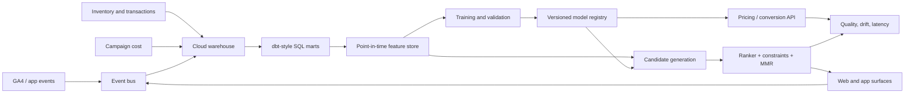

# CARS24-scale system design

This repository is a reproducible vertical slice, not a claim that one DuckDB
file replaces the production marketplace stack. Its contracts map cleanly to a
larger design.

## Online recommendation path

1. Retrieve collaborative, content, session-intent, popularity, and inventory
   candidate sets in parallel.
2. Apply availability and policy filters.
3. Score with point-in-time price, booking, and ranker features.
4. Use the validation-selected relevance blend, then apply business constraints
   only when the relevance floor is satisfied.
5. Apply entropy-adaptive MMR diversity and log every exposure with model and
   feature versions.

## Data contracts

- GA4 ingestion maps event taxonomy, pseudo-user/session identity, item IDs,
  attribution, engagement time, device, and geography at the boundary.
- Semantic marts declare one row grain and centralize reusable business logic.
- Training data uses event-time joins and explicit train/validation/test cutoffs.
- Labels such as sale outcome and purchase are blocked from serving features.
- Recommendation evaluation uses position propensity correction; deployment
  should add randomized exploration traffic for stronger counterfactual estimates.

## Production additions

At larger scale, replace local Parquet/DuckDB and joblib storage with partitioned
warehouse tables, orchestration, an offline/online feature store, a registry,
autoscaled inference, a cache, and a streaming exposure/outcome join. Add latency
SLOs, schema alerts, segment fairness reviews, canary releases, shadow scoring,
and champion/challenger experiments. Pricing recommendations require human and
policy controls before they influence a real transaction.
